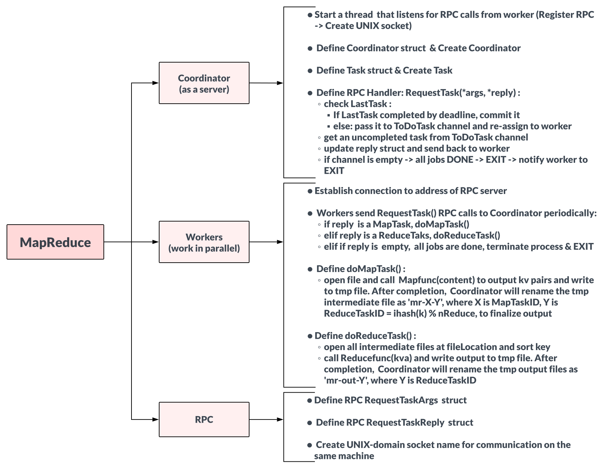
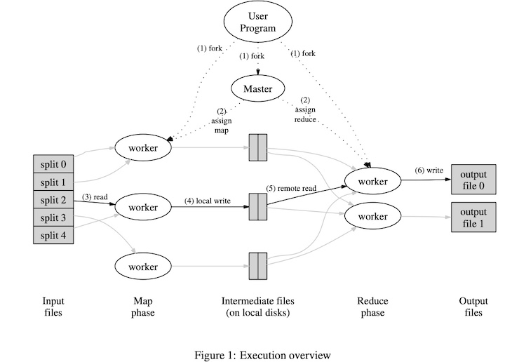

This is part of my self-study of MIT 6.824 Distributed Systems on lab 1 MapReduce. Since the course doesn't recommend posting course materials, I only post my own solution. 

# About this repo:

Implement a distributed MapReduce system with Go, based on [Google's MapReduce paper in 2004.](http://static.googleusercontent.com/media/research.google.com/en//archive/mapreduce-osdi04.pdf)

### There are 2 major differences: 

1. In a real system the Workers would run on a bunch of different machines, but for this lab you'll run them all on a single machine.
2. In the MapReduce paper describes the Coordinator pushing tasks to Workers, but for this lab, we were told to have Workers call the Coordinator using remote procedure calls (RPCs) to ask for tasks instead.

# Design Diagram:

This MapReduce system consisting of 3 major parts:

# Implementation Details

The MapReduce system can be implemented in many ways, but this implementation is specific to Google at the time of writing this paper.

### What is MapReduce? 
MapReduce is a system for parallelizing the computation of a large volume of data across multiple machines in a cluster. The Map task takes an input file and outputs a set of intermediate (key, value) pairs. The intermediate values with the same key are then grouped together and processed in the Reduce task for each distinct key.

The flow of execution when the MapReduce function is called: (1 big text file, nReduce = 2)

    file: Hello, my name is Sue, your name? || Hello, your name is Tom. (split into 2 files)

    After perform Map() on each split:

    file 1: [{"Hello", 1}, {"my", 1}, {"name", 1}, {"is", 1}, {"Sue", 1}, {"your", 1}, {"name", 1}]
    file 2: [{"Hello", 1}, {"you", 1}, {"name", 1}, {"is", 1}, {"Tom", 1}]

    After partition: calculate (ihash(key) % nReduce) and pass intermediate kv pairs to the corresponding reduce machines:

    file 1: {"Hello", 1}, {"my", 1}, {"name", 1},{"name", 1},{"is", 1}, {"Sue", 1}, {"your", 1}
    file 2: {"Hello", 1}, {"name", 1}, {"is", 1}, {"Tom", 1}, {"your", 1}
    |------------reduce machine 1-------------------|------------reduce machine 2-----------| 

    {"Hello",[1,1]},{"my",[1]},{"name",[1,1,1]},{"is", [1,1]} ---> reduce machine 1
    {"Sue", 1}, {"your", [1,1]}, {"Tom", 1}                 ---> reduce machine 2

    After perform Reduce() & sort key in increasing order:
    reduce machine 1 ouput: 
    Hello 2
    is    2
    my    1
    name  3
   
    reduce machine 2 ouput: 
    Sue   1
    Tom   1
    your  2
    

### Details about the flow of MapReduce: 
- The Coordinator splits the input into X files(each size 16~64 MB) and pass them to the ToDoTask channel and wait for the Worker's rpc to request tasks.

- Multiple Workers execute in parallel and periodically make rpc to request task. In total, there are X map tasks and Y reduce tasks.

- When a Worker receives a Map task, it reads input from its corresponding split, performs Map operations, and then emits intermediate (key, value) pairs which are buffered in memory as a tmp file.

- These tmp files are written to local disk by Coordinator, partitioned into Y regions according to the partitioning scheme. The locations of these files on local disk are passed to the Reduce workers.

- Until all Map tasks are completed, the Coordinator starts assigning Reduce tasks.

- In the Reduce task, the Worker reads the buffered data from local disk based on the location it is forwarded by Coordinator. When all intermediate data has been read, it sorts the values according to the key and groups all occurrences for the same key together.

- For each distinct intermediate key, the Worker passes its grouped values to the Reduce function defined. The output of this Reduce function is appended to a final output file.

- The final output of a MapReduce job is a set of Y files (one per Reduce task).

### Details about the mechanisms between Coordinator and Workers: 

- mrcoordinator file calls the MakeCoordinator function of the Coordinator struct to create the Coordinator node. Then it send each file to ToDoTask channel with filename and its index. Channel is used for concurrent programming with Go.

- mrworker file creates multiple Workers instances that work in parallel and send RPC call to request task from Coordinator.

- RPC.go file consists of args and reply structs. There is a call function inside Worker.go is responsible for RPC calls.

- After Worker receives a task, it perform Mapfunc() or Reducefunc() based on the task's type, and both functions are injected via Go’s plugin mechanism.

- After all the Map tasks are completed, the Coordinator can switch to 'Reduce' mode and assign reduce tasks.

- When a task is done, have the Worker send a 'task is completed' signal to Coordinator and let the Coordinator rename and commit the final ouput.

### Rules:

- Use Go’s race detector to detect unsynchronised read/writes to the same memory and reports them as a failure (which it is).

# Bugs, Challenges & Optimizations:

#### 1. About concurrency in Go:

- The coordinator, as an RPC server, will be concurrent and need to use sync.Mutex to lock shared data(ToDoTask channel and Status map). Originally I applied the mutex lock very specifically, only when multiple Workers request tasks in parallel, because I wanted to avoid multiple threads waiting for the same mutex too often and that would result in low performance. But since the race condition being dectected by Go Race detector, I applied the mutex to other functions on the Coordinator and everything on Coordinator will execute sequentially.

#### 2. About atomic write:

- To ensure that nobody observes partially written files in the presence of crashes, the MapReduce paper mentions the trick of using a temporary file and atomically renaming it once it is completely written. Use ioutil.TempFile to create a temporary file and os.Rename to atomically rename it. In the paper, when a task is completed, both Worker and Coordinator can write the final output files, and synchronization bugs occured because same file being rewrite and rename repeatedly. 

    Optimization: To simplify the design, minimize numbers of RPC calls and decouple the write and commit process, I only allow coordinator to commit when the Coordinator receive a 'task is completed' signal from Worker.

#### 3. About dealing with faults:

- Workers Failures: 
    - I originally designed the Coordinator pings all Workers periodically. If no response is received from a Worker after some period of time, the Worker is marked as failed. The tasks assigned to the failed Worker are then reassigned to other Worker. However, identifying the unresponsive Workers is not enough, because the Coordinator can’t reliably distinguish between 1) crashed Workers, 2) Workers that are alive but have stalled for some reason, and 3) Workers that are executing but too slowly to be useful. In the paper, chapter 3.6: 
 
        
<i>"We have a general mechanism to alleviate the problem of stragglers. When a MapReduce operation is close to completion, the master schedules backup executions of the remaining in-progress tasks. The task is marked as completed whenever either the primary or the backup execution completes. We have tuned this mechanism so that it typically increases the computational resources used by the operation by no more than a few percent. We have found that this significantly reduces the time to complete large MapReduce operations. As an example, the sort program described in Section 5.3 takes 44% longer to complete when the backup task mechanism is disabled." </i> 

    Optimization: In order to better handle 3 scenarios above and simplify the design, I added an attribute Deadline(10s after its startTime) of each task. When the Coordinator iterates every task and pass the unassigned task to the ToDoTask channel, it will wait for 10s for each assgined tasks to be completed. If any assigned task has not been completed by Deadline, this task will mark as uncomplete, pass it to ToDoTask channel, and wait for re-assginment to other Worker again.
    
- Coordinator Failures: 
    -  If the Coordinator fails, the implementation simply aborts the whole execution and will retry from the start again.
    -  An alternative idea is to have the Coordinator periodically checkpoint its state, so that a retry could pick up from where the execution left off.

## Final Thoughts:

I learned a lot from this lab and I really enjoy learning every single piece of new knowledge from it. 

I tried hard to stick closely to the details and spec given in the MapReduce paper, but after doing a code review with others, I realized that the design and the code can be cleaner if I don't strictly follow it, or I should be more flexible about following it. 

For example, when dealing with Workers failures, instead of having Workers send heartbeat and completion status to Coordinator, and let the Coordinator to decide if this Worker is a failure and need to re-assign the task to others, I can simplify it by creating a seperate Goroutine on Coordinator to check if task is completed by deadline(startTime + 10s). If not, pass this uncompleted task to ToDoTask channel and re-assign later. 

MapReduce is no longer in use at Google now, but it fundamentally changed the way of large scale data processing architecture. It abstracted the complexity of dealing with parallelism, fault-tolerance and load balancing by exposing a simple API that allowed programmers without experience with these systems to distribute the processing of large datasets across a cluster of computers.

## Notes & Highlight:
Go, concurrent programming, parallelism, mutual exclusions(mutexes), channel, RPC, [Go’s net/rpc package](https://ops.tips/gists/example-go-rpc-client-and-server/), thread, process, MapReduce...

- Why Go?
  - good support for threads
  - convenient RPC
  - type safe
  - garbage-collected (no use after freeing problems)
  - threads + GC is particularly attractive!
  - relatively simple

- Threads
  - a useful structuring tool, but can be tricky
  - Goroutines are lightweight threads in Go
  - Thread = "thread of execution"
  - threads allow one program to do many things at once
  - each thread executes serially, just like an ordinary non-threaded program
  - the threads share memory
  - each thread includes some per-thread state: program counter, registers, stack

- Why threads?
  - They express concurrency, which you need in distributed systems
  - I/O concurrency
  - Client sends requests to many servers in parallel and waits for replies.
  - Server processes multiple client requests; each request may block.
  - While waiting for the disk to read data for client X, process a request from client Y.
  - Multicore performance
  - Execute code in parallel on several cores.
  - Convenience

- Threading challenges:
  - shared data 
    e.g. what if two threads do n = n + 1 at the same time?
      or one thread reads while another increments?
    this is a "race" -- and is usually a bug
    -> use locks (Go's sync.Mutex)
    -> or avoid sharing mutable data
  - coordination between threads
    e.g. one thread is producing data, another thread is consuming it
      how can the consumer wait (and release the CPU)?
      how can the producer wake up the consumer?
    -> use Go channels or sync.Cond or WaitGroup
 -  deadlock
    cycles via locks and/or communication (e.g. RPC or Go channels)
